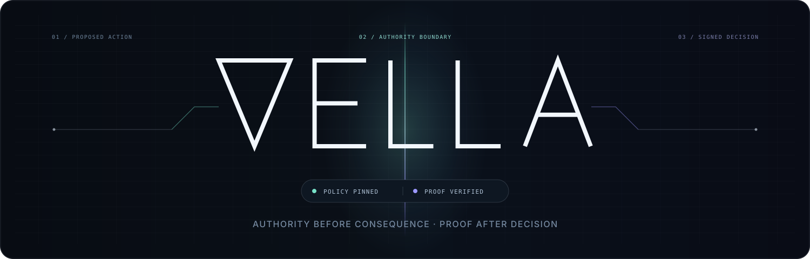
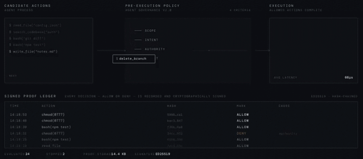

<p align="center">
  
</p>

[](https://doi.org/10.5281/zenodo.19738376)
[](https://github.com/vellacognitive/vella-substrate/actions/workflows/test-sdk.yml)
[](https://github.com/vellacognitive/vella-substrate/actions/workflows/verify-test-vectors.yml)
[](https://github.com/vellacognitive/vella-substrate/actions/workflows/lint-schemas.yml)

# VELLA: Governance Substrate for AI Agents & Autonomous Systems

[](LICENSE)

**An agent can propose the action. VELLA decides whether it has authority to happen and leaves proof of the decision.**

<p align="center">
  
</p>

**VELLA is the decision layer between an AI agent or autonomous system proposing an action and that action being taken.** It sits where alignment, input safety, and IAM don't: at the specific moment an autonomous system is about to act, under a specific policy, with specific evidence in hand.

Given a proposed action and an evidence mask, VELLA returns `ALLOWED` or `DENIED` deterministically and emits a cryptographically signed proof bundle. The bundle can be verified offline by any third party with only the bundle and a public key. No access to VELLA, the agent, or the originating system is required.

This is a reference implementation, MIT-licensed. It's designed to be the primitive that agent frameworks, audit pipelines, and compliance systems build on.

## What this repo proves

This repository demonstrates the core VELLA primitive:

1. Before an action runs, the caller submits a proposed intent, such as `DATA_EXPORT`, `ESCALATE_PRIVILEGE`, or `EXECUTE_CHANGE`, along with evidence indicators.
2. VELLA evaluates that request against policy.
3. VELLA returns a deterministic `ALLOWED` or `DENIED` decision.
4. `DENIED` is fail-closed: the caller must not execute the action.
5. If signing is enabled, VELLA emits a proof bundle.
6. That proof bundle can be verified offline using the tools in this repo.

VELLA decides whether an action is authorized before it runs. The calling system remains responsible for carrying out or blocking the action.

The SDK is designed for in-process, low-latency adjudication; the authority decision can sit directly on the action path rather than being deferred to post-hoc logging.

**Start here:**

- [An Inspectable Substrate for AI Governance](https://vellacognitive.com/research/an-inspectable-substrate-for-ai-governance): the conceptual argument (~14 min read)
- [Quickstart](#quick-example): Node or Python SDK, working example in 2 minutes
- [GitHub Actions authority gate](integrations/github-action/README.md): block a protected workflow step on `DENIED`
- [Integration map](INTEGRATIONS.md): shipped surfaces, compatible hook points, and planned adapters
- [Use-case registry](USE_CASES.md): concrete consequence boundaries and deny-path obligations
- [Public roadmap](ROADMAP.md): shipped, next, and exploratory work
- [Threat model](spec/threat-model.md): what VELLA does and does not protect against
- [AI-assisted integration prompting](AI_INTEGRATION_PROMPTING.md): prompt patterns for using AI coding agents to integrate VELLA without outsourcing authority decisions

## How VELLA differs

VELLA is not an agent framework, policy daemon, proxy, or governance platform. It is the embedded authority primitive those systems can call when a proposed action needs a deterministic, evidence-conditioned decision and a proof that survives the originating system.

| Adjacent system | Primary job | VELLA's boundary |
|---|---|---|
| Agent framework | Plans work and invokes tools | VELLA does not own the loop; it adjudicates the proposed consequential action |
| General policy engine | Evaluates broad application policy | VELLA binds an action, authority scope, policy version, and evidence state to `ALLOWED` or `DENIED` |
| Proxy or gateway | Intercepts and forwards traffic | The embedded SDK supplies the authority decision; the caller remains the enforcement point |
| Audit or logging system | Records what happened | VELLA decides before execution and can emit a signed, offline-verifiable proof bundle |
| Authority or receipt protocol | Standardizes authority exchange | VELLA is a small implementation substrate with a compiled policy path, evidence-conditioned adjudication, and portable proof |

The useful combination is **minimal + embedded + evidence-conditioned + deterministic + independently verifiable**. See the [public positioning and provenance note](docs/positioning-and-provenance.md) for the narrower claim VELLA makes within the emerging execution-authorization category.

## Integration surfaces

| Surface | Public status | Use it for |
|---|---|---|
| Node.js and Python SDKs | **Shipped** | In-process action gates with no network dependency |
| GitHub Actions authority gate | **Shipped reference adapter** | Protected deployment, release, or change-control jobs |
| Generic tool-dispatch hook | **Documented pattern** | Agent harnesses that expose a pre-tool-call interception point |
| Claude Code / Claude Agent SDK, MCP client dispatch, LangGraph, OpenAI Agents | **Compatible insertion points; dedicated adapters planned** | Framework-native distribution without coupling the substrate to a framework |
| HTTP, gRPC, sidecar, and Kubernetes surfaces | **Commercial components; not published here** | Polyglot, network-boundary, and multi-tenant enforcement |

Status means exactly what it says: named compatibility is not represented as a maintained adapter until adapter code and tests exist in this repository. See [INTEGRATIONS.md](INTEGRATIONS.md) for the current matrix.

## Install

```bash
npm install @vellacognitive/vella-sdk
```

```bash
pip install vella-sdk
```

The Node package has no runtime dependencies. The Python package depends only on [`cryptography`](https://pypi.org/project/cryptography/) for ECDSA signing. Python 3.10+ required; Node 18+ required.

Python applications with an application-supplied policy can use the stable `from vella import create_evaluator` API. See the [Python SDK custom-policy documentation](sdk/python/README.md#custom-policy-evaluators).

Releases on npm and PyPI are published via [Trusted Publisher](https://docs.pypi.org/trusted-publishers/) (OIDC) from this repository's tagged GitHub Releases. The npm package carries [provenance attestations](https://docs.npmjs.com/generating-provenance-statements) you can verify with `npm audit signatures`.

## Quick example

```js
import { govern } from "@vellacognitive/vella-sdk";
import fs from "node:fs";

const signingKey = fs.readFileSync("./example-signing.key", "utf8");

const result = govern({
  intent: "EXECUTE_CHANGE",
  evidenceMask: 1,
  proof: { signingKey },
});

console.log(result.decision, result.reasonCode);
console.log(result.proofBundle.envelope_id);
```

```python
from vella import govern

signing_key = open("./example-signing.key", "r", encoding="utf-8").read()

result = govern(
    intent="EXECUTE_CHANGE",
    evidence_mask=1,
    proof_signing_key=signing_key,
)

print(result["decision"], result["reason_code"])
print(result["proof_bundle"]["envelope_id"])
```

## Local development

Contributors and anyone running an unreleased revision against their own code path:

### Node SDK from source

```bash
git clone https://github.com/vellacognitive/vella-substrate.git
cd vella-substrate/sdk/node
npm ci
npm test
```

To install the source checkout into another project, `npm pack` produces a tarball that `npm install /path/to/tarball.tgz` will accept.

### Python SDK from source

```bash
git clone https://github.com/vellacognitive/vella-substrate.git
cd vella-substrate/sdk/python
python3.10 -m venv .venv      # 3.10+ required; replace with python3.11/3.12 as available
. .venv/bin/activate
python -m pip install --upgrade pip
pip install -e ".[dev]"
pytest
ruff check .
mypy --strict vella/
```

## What this repository contains

- SDK:
  - `sdk/node/` and `sdk/python/` embedded SDKs for local adjudication + signed proof bundles
- Spec:
  - `spec/icd.md`, `spec/threat-model.md`, `spec/reason-codes.md`, and `spec/schemas/`
- Verifiers:
  - `verify/verify.js`, `verify/verify.py`, `verify/verify.sh` standalone proof-bundle verifiers
- Test vectors:
  - `test-vectors/valid/` and `test-vectors/tampered/` for verifier CI and audit workflows
- Benchmarks:
  - `benchmarks/` reproducible latency harness for both SDKs. See [`benchmarks/README.md`](benchmarks/README.md) for methodology and reference results
- Integrations:
  - `integrations/github-action/` fail-closed GitHub Actions reference adapter
- Public adoption docs:
  - `INTEGRATIONS.md`, `USE_CASES.md`, `ROADMAP.md`, and `docs/positioning-and-provenance.md`

## Where this SDK fits

The VELLA SDK in this repository is one of several VELLA components. It runs in-process inside Node.js and Python applications and is designed for agent hooks, CI/CD gating, edge compute, research notebooks, and any other context where a library-level adjudicator with microsecond latency is the right fit.

For enterprise service mesh deployments, polyglot environments, network-boundary enforcement, Kubernetes admission control, or multi-tenant adjudication, the runtime service and sidecar adapter (available via commercial license from Vella Cognitive, LLC) are the appropriate components.

See [DEPLOYMENT.md](DEPLOYMENT.md) for the complete deployment scope and the table of technical specifications.

For commercial licensing or integration services: `agent@vellacognitive.com`

## How to verify a proof bundle

```bash
node verify/verify.js examples/allowed-bundle.json examples/example-signing.pub
python verify/verify.py examples/allowed-bundle.json examples/example-signing.pub
bash verify/verify.sh examples/allowed-bundle.json examples/example-signing.pub
```

## License

This repository is released under the MIT License.

## Security

See [SECURITY.md](SECURITY.md).

## Citing this work

If you reference VELLA in research, writing, or technical documentation, please cite:

> Wilson, M. (2026). *An Inspectable Substrate for AI Governance*. Zenodo. https://doi.org/10.5281/zenodo.19738376

The conceptual argument accompanying this release is available as a companion essay:

> Wilson, M. (2026). *An Inspectable Substrate for AI Governance*. Vella Cognitive. https://vellacognitive.com/research/an-inspectable-substrate-for-ai-governance

Machine-readable citation metadata is available in [CITATION.cff](CITATION.cff).

## Contributing

See [CONTRIBUTING.md](CONTRIBUTING.md) and [CODE_OF_CONDUCT.md](CODE_OF_CONDUCT.md).

## Contact

agent@vellacognitive.com
